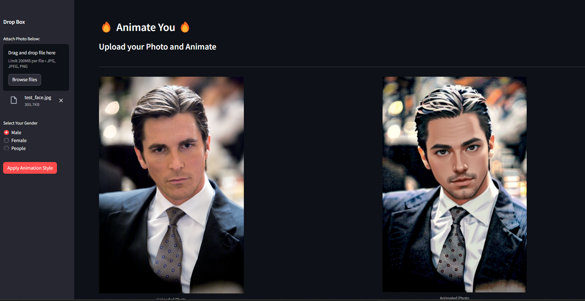
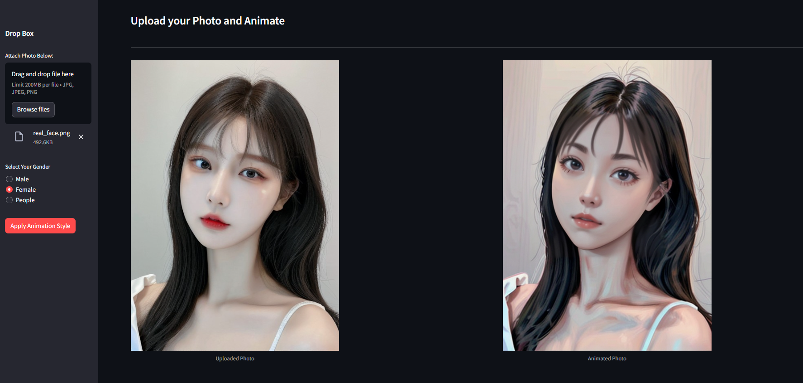
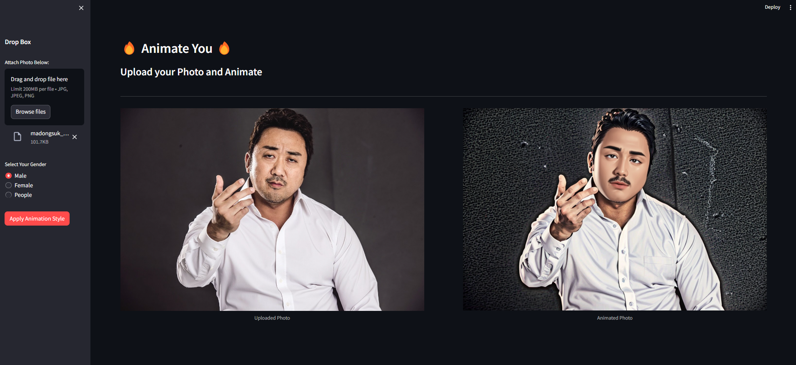

# Animate You
**StableDiffusion API (백엔드)** & **Streamlit (프론트엔드)** 를 사용하여 만든 프로젝트 입니다.   사진을 업로드하고 **버튼("Apply Animation Style")** 을 눌러 자신/사진을 쉽게 **애니매이션화** 할 수 있습니다.  

성별에 따라 **"Male"**, **"Female"**, **"People"** 를 선택하여 원하는 애니메이션 사진을 얻을 때 까지 사용할 수 있습니다.

 

 

## Installation
시작하기 앞서 **Stable Diffusion WebUI** 가 설치되어 사용법 및 API로 실행되고 있는 상태라 생각하고 설명하겠습니다. (추가로 본인은 "Dark Sushi 2.5D 모델"을 사용하였으나(권장), 다른모델을 사용하여 테스트/사용하셔도 무관합니다.) 

 
 
**1. Requirements:**
1. Python Version 3.10.0 설치
2. requirements.txt 필요/담긴 라이브러리 설치
3. animate_me_prj 디렉토리로 이동 및 CMD 실행
4. CMD:
   - **streamlit run main.py**

 

**2. GPU Used:**
 - NVIDIA GeForce RTX 3080 Ti Laptop GPU (16GB)
 - Minimum 12GB GPU memory recomanded

 

## Usage
사진을 업로드 후, "Select Your Gender"에 원하는 버튼을 클릭후 "Apply Animation Style"버튼을 클릭합니다. 이미지 변환은 1~2분 가량 소요됩니다.  

> 변환된 이미지는 **"history_ouput"** 폴더에 자동 저장됩니다. 필요시 화면에서도 다운로드 가능합니다.

 

#### Examples:

 

